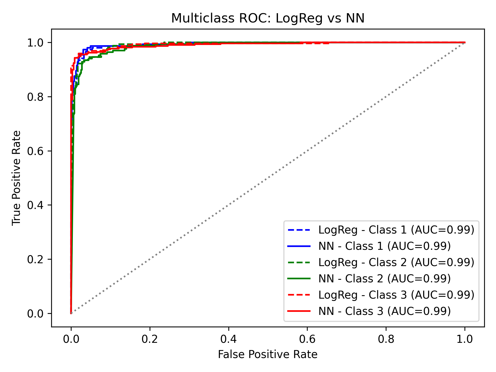
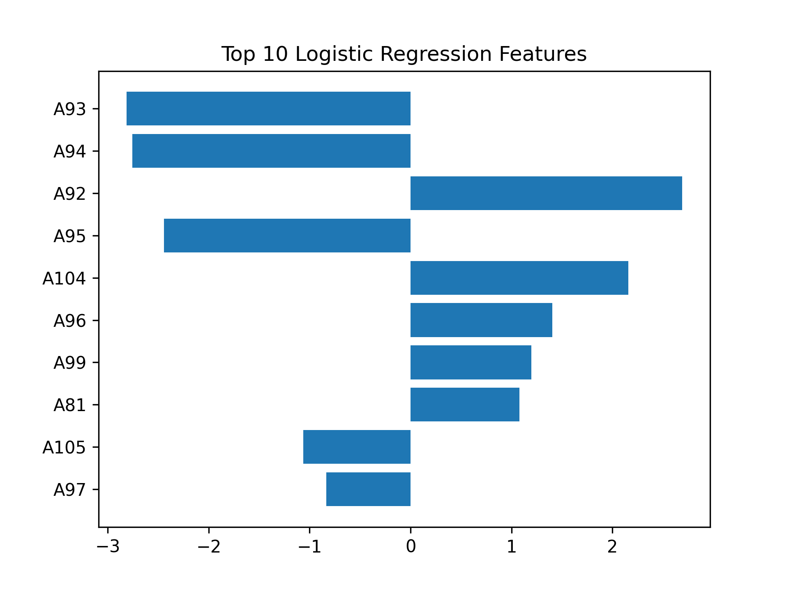
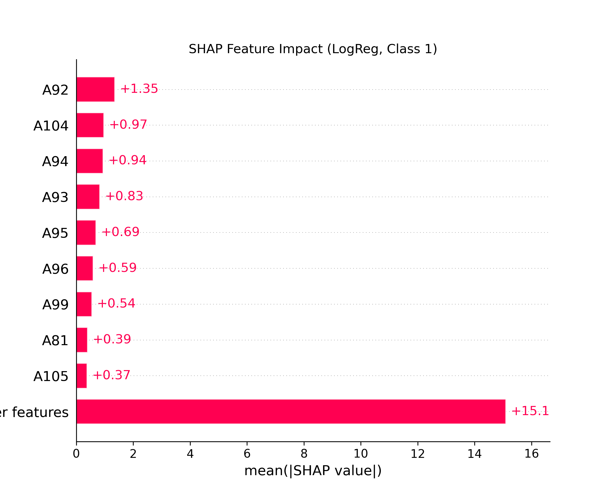

# 🧬 Biosequence Classifier  
*A Multi-Model Pipeline for Classifying DNA Sequences using Logistic Regression, Neural Networks, SHAP, and Ensemble Learning*

## 💡 Overview
This project implements a full-stack machine learning pipeline to classify DNA sequences into biological classes using both traditional and deep learning models. It features interpretability with SHAP, detailed performance diagnostics, and a soft-voting ensemble that boosts classification accuracy to **95.4%** on test data.

> **Built with love using:**  
> `Scikit-learn`, `TensorFlow/Keras`, `Matplotlib`, `SHAP`, and `Seaborn`.

---

## 🔬 Models Included
- **Logistic Regression** with feature importance analysis  
- **Neural Network** with dropout, softmax output, and training visualizations  
- **Voting Ensemble** (LogReg + NN) with soft voting  
- **SHAP Explainability** for LR feature impacts  
- **GridSearchCV** for optimal hyperparameter tuning  
- **5-Fold Cross-Validation** to verify generalization

---

## 📊 Key Results

| Model               | Accuracy | Macro AUC | Notes                         |
|--------------------|----------|-----------|-------------------------------|
| Logistic Regression| 94.4%    | 0.9918    | Default LR with GridSearch    |
| Neural Network     | 93.7%    | 0.9930    | 2-layer NN + dropout regularization |
| Voting Ensemble    | **95.5%**| –         | Soft voting (LR + NN)         |

---

## 📁 Outputs (Visuals)

| Confusion Matrices | ROC Curves | Feature Importance | SHAP |
|--------------------|------------|---------------------|------|
|  |  |  |  |

Also includes:
- Training history: `nn_accuracy_loss.png`  
- Class-wise metrics: `nn_precision_recall.png`  
- CV plot: `cv_logreg.png`

---

## 🧠 Project Structure
BiosequenceClassifier/
├── classifier.py              # Main script for model training, evaluation, and plotting
├── dna.csv.zip                # Zipped CSV file containing the DNA dataset
├── outputs/                   # Directory with auto-generated graphs and model outputs
│   ├── conf_matrix_logreg.png
│   ├── conf_matrix_nn.png
│   ├── nn_accuracy_loss.png
│   ├── nn_precision_recall.png
│   ├── roc_comparison_multiclass.png
│   ├── top_features_logreg.png
│   ├── shap_logreg.png
│   ├── cv_logreg.png
│   └── model_summary.csv
├── promoter_nn_model.h5       # Saved Keras model (HDF5 format, legacy)
└── promoter_nn_model.keras    # Saved Keras model in native Keras format

---

## 🧬 Dataset
- **Source**: `dna.csv`  
- **Format**: 180 binary-encoded nucleotide features (A0–A179)  
- **Target**: 3-class classification problem (`0`, `1`, `2`)  

---

## Try It Yourself

Clone the repo and run:

python classifier.py

Make sure you have the necessary dependencies:

pip install -r requirements.txt

Future Work
- Add additional deep learning architectures (CNNs, RNNs)
- Benchmark with real-world genomic datasets
- Deploy via Flask or Streamlit for interactive input

Author
    Soli Ateefa
    Bioinformatics • Deep Learning • Data Aesthetics
    [LinkedIn](https://www.linkedin.com/in/solia)
    [GitHub](https://github.com/sateefa2904)

