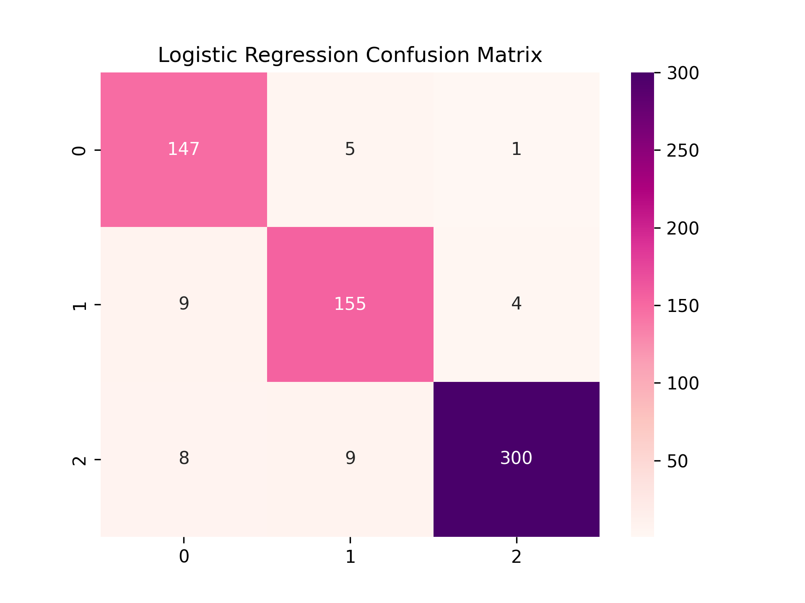
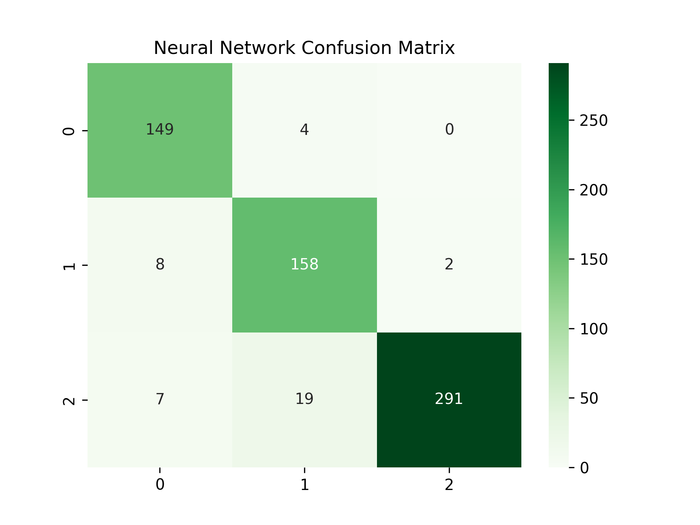
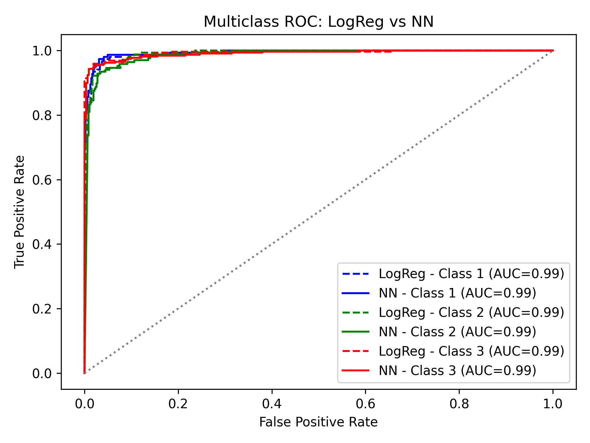
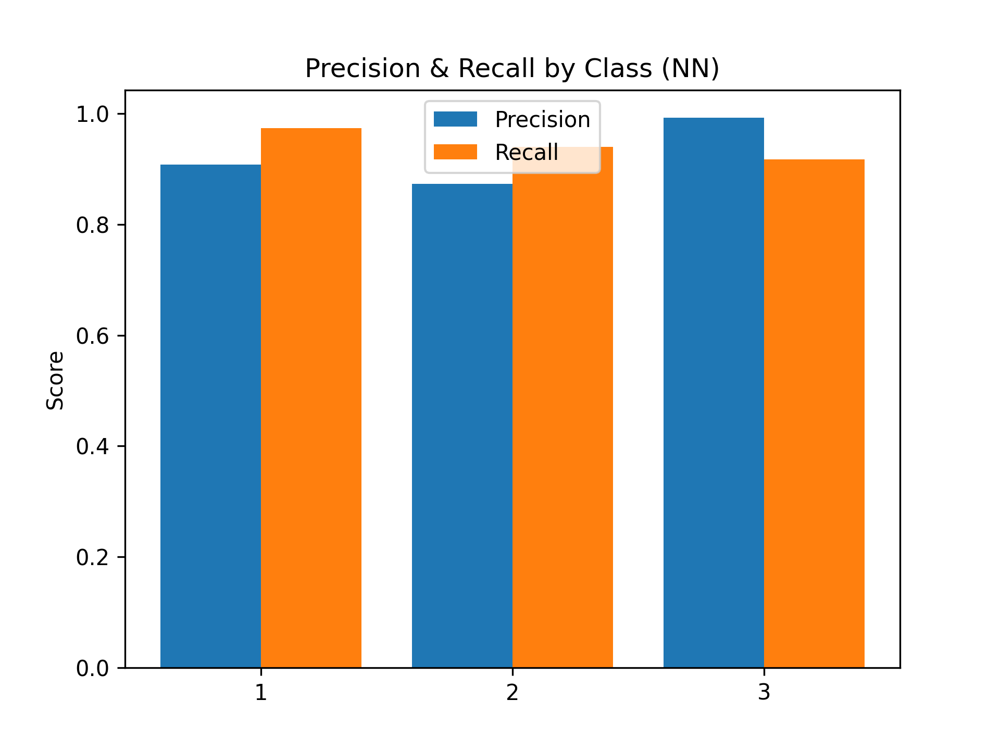
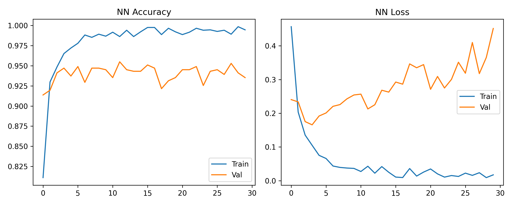
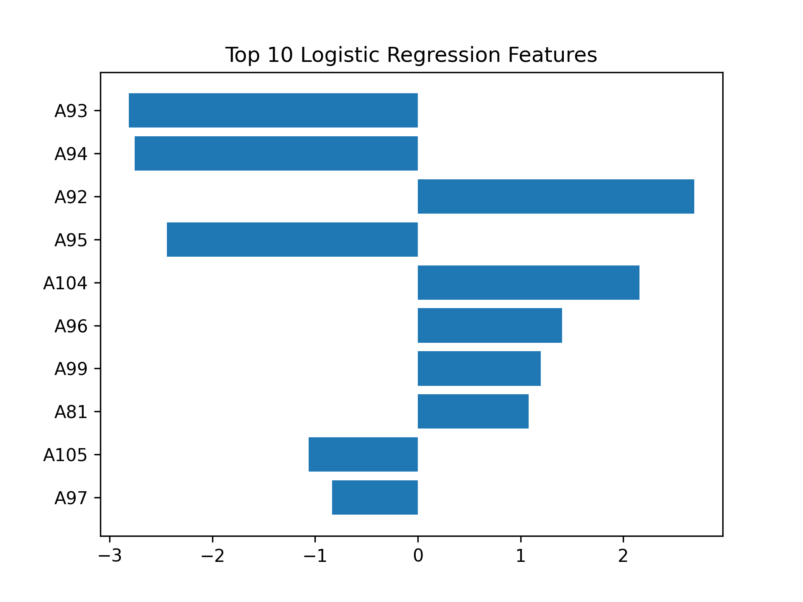
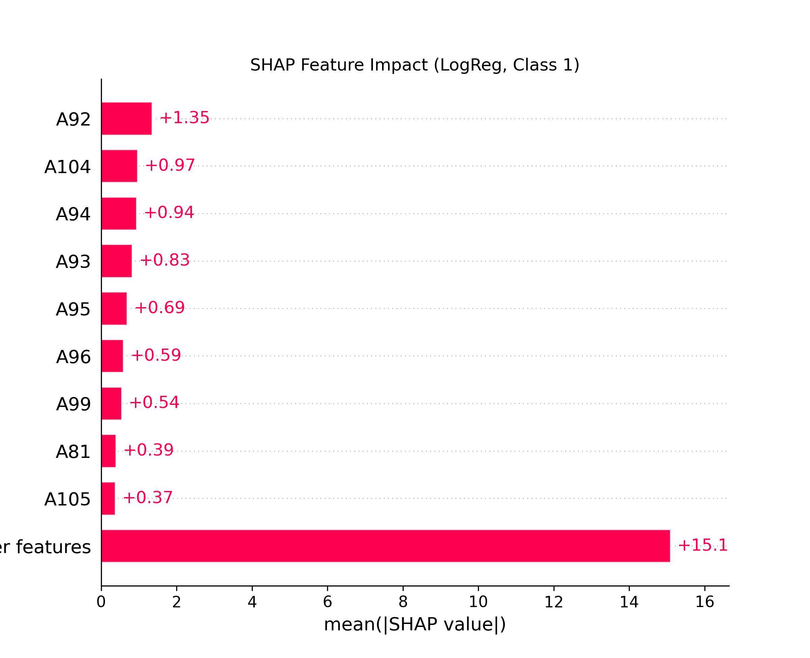

# 🧬 Biosequence Classifier
A Multi-Model Pipeline for Classifying DNA Sequences using Logistic Regression, Neural Networks, SHAP, and Ensemble Learning.

---

## 💡 Overview

This project implements a full-stack machine learning pipeline to classify DNA sequences into biological classes using both traditional and deep learning models. It features:

- Logistic Regression with SHAP explainability
- Neural Network with dropout & training diagnostics
- Soft Voting Ensemble (LogReg + NN)
- ROC, confusion matrix, cross-validation & precision-recall plots
- Model interpretability through top features

Built with love using:  
`scikit-learn`, `TensorFlow/Keras`, `matplotlib`, `seaborn`, `shap`

---

## 🔬 Models Included

- **Logistic Regression:** baseline model with feature impact visualizations
- **Neural Network:** 2 hidden layers + dropout regularization
- **Voting Classifier:** ensemble with soft-voting (LR + NN)
- **SHAP Explainability:** for global feature impact (LogReg)
- **GridSearchCV:** optimal hyperparameter tuning
- **5-Fold Cross-Validation:** generalization testing

---

## 📊 Key Results

| Model              | Accuracy | Macro AUC | Notes                           |
|-------------------|----------|-----------|----------------------------------|
| Logistic Regression | 94.4%    | 0.9918    | Default LR with GridSearch       |
| Neural Network      | 93.7%    | 0.9930    | 2-layer NN + dropout regularization |
| Voting Ensemble     | **95.5%** | –         | Soft voting (LogReg + NN)        |

---

## 📁 Outputs (Visuals)

### 🔹 Confusion Matrices
<center></center>  
<center></center>

### 🔹 ROC Curve
<center></center>

### 🔹 Precision & Recall by Class
<center></center>

### 🔹 Training Diagnostics
<center></center>

### 🔹 Top Features & SHAP
<center></center>  
<center></center>

---

## 🧠 Project Structure
- `classifier.py` — Main training + evaluation pipeline
- `dna.csv.zip` — Zipped dataset
- `requirements.txt` — List of required packages
- `outputs/` — All generated graphs and output files:
  - `conf_matrix_logreg.png`
  - `nn_accuracy_loss.png`
  - `roc_comparison_multiclass.png`
  - `shap_logreg.png`
  - ...
- `promoter_nn_model.h5` — Saved neural net model (legacy format)
- `promoter_nn_model.keras` — Saved neural net (Keras native)
---

## Dataset

- **Source:** `dna.csv`
- **Features:** 180 binary-encoded nucleotide inputs (A0 to A179)
- **Target:** 3-class classification (0, 1, 2)

---

## Try It Yourself

Clone the repo and run the classifier:

```bash
git clone https://github.com/sateefa2904/Biosequence-Classifier.git
cd Biosequence-Classifier
pip install -r requirements.txt
python classifier.py

---

## Future Work

-  **Explore advanced architectures**  
  Integrate CNNs or RNNs to better capture sequential DNA features.

-  **Benchmark on real-world genomic datasets**  
  Test the model's robustness on public biological datasets.

-  **Deploy the pipeline**  
  Package the classifier using Flask or Streamlit for interactive, web-based predictions.

-  **Automate model selection**  
  Add automated ensembling or AutoML approaches for tuning.

-  **Dataset expansion**  
  Integrate additional features like nucleotide k-mer frequency or methylation signals.

---

## Author

**Soli Ateefa**  
*Bioinformatics • Deep Learning • Data Aesthetics*
- [LinkedIn](https://www.linkedin.com/in/sateefa2904)  
- [GitHub](https://github.com/sateefa2904)


